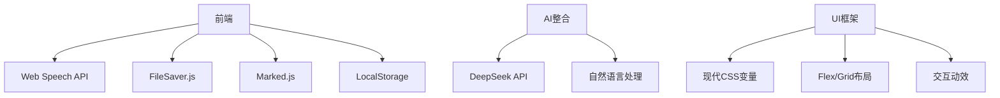

# 🎤 智能语音转写系统


现代Web语音识别解决方案，提供实时转录、智能总结和跨平台支持

📂 [立即体验](语音转文字.html) | 🛠 [功能特性](#rocket-功能特性) | 📱 [移动端支持](#iphone-移动端优化)

<div align="right">
<details>
<summary>📑 目录导航</summary>

1. [✨ 项目亮点](#-项目亮点)
2. [🚀 功能特性](#rocket-功能特性)
3. [🛠 技术栈](#-技术栈)
4. [📱 移动端优化](#iphone-移动端优化)
5. [🏁 快速开始](#-快速开始)
6. [🔧 开发指南](#-开发指南)
7. [🌍 应用场景](#-应用场景)
</details>
</div>

## ✨ 项目亮点

<div class="grid" markdown>
!!! success "实时语音转文字"
    支持连续语音识别，实时显示转录结果

!!! success "AI智能总结"
    集成深度求索API，一键生成内容摘要

!!! success "跨平台兼容"
    完美适配桌面和移动端浏览器

!!! success "数据安全"
    本地存储加密，自动保存保障数据
</div>

## :rocket: 功能特性

### 🎙 核心功能
- 实时语音文字转换（支持中文）
- 智能分段与时间戳标记
- 自动保存至本地存储
- 多浏览器兼容（Chrome/Firefox/Safari）

### 🧠 AI增强
- 深度求索大模型内容总结
- 关键信息提取与高亮
- 多维度分析报告生成
- 自定义提示词模板

### 🎨 交互设计
- 响应式布局（适配手机/平板/桌面）
- 实时滚动更新机制
- 可视化状态指示器
- 触控优化操作界面

## 🛠 技术栈



## :iphone: 移动端优化

| 特性                | iOS支持 | Android支持 |
|---------------------|---------|-------------|
| 语音识别            | ✅       | ✅           |
| 长按启动            | ✅       | ✅           |
| 后台持续运行        | ✅       | ✅           |
| 权限自动管理        | ✅       | ✅           |

## 🏁 快速开始

```bash
# 直接双击打开（推荐Chrome）
双击 语音转文字.html

# 或通过本地服务器
python3 -m http.server 8000
打开 http://localhost:8000
```

## 🔧 开发指南

1. 克隆仓库
2. 修改配置项：
```javascript
const DEEPSEEK_CONFIG = {
  API_URL: 'https://api.siliconflow.cn/v1/chat/completions',
  MODEL: 'Pro/deepseek-ai/DeepSeek-R1',
  // 替换为您自己的API密钥
  API_KEY: 'sk-your-api-key-here' 
};
```
3. 自定义样式：修改`style`标签内CSS变量
4. 扩展功能：在`RECOGNITION_CONFIG`中添加新配置

## 🌍 应用场景

<details>
<summary>📊 典型使用案例</summary>

- 会议实时记录
- 访谈内容整理
- 课程讲座转录
- 内容创作助手
- 语音备忘录转换
</details>

## 📜 许可证
MIT License © 2024 [Your Name]
